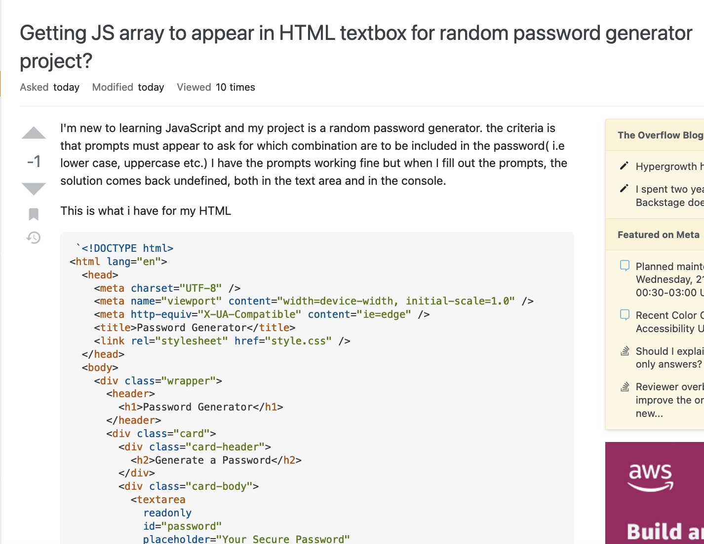

```{r setup, include=FALSE}
knitr::opts_chunk$set(echo = TRUE)
```
---
title: 'DS 202 - Homework #1'
author: 'Vanessa Whitehead'
date: '09/19/2022'
---

## Asking good questions


Asking good questions is a valuable skill to have - asking questions in an online setting is both easier and harder than asking questions in person: we can prepare to ask a question but we are also expected to prepare.
The links posted here give some advice on how to ask good questions:

- stackoverflow's [Asking a good question](http://stackoverflow.com/help/how-to-ask)

- R's [Posting guidelines](https://www.r-project.org/posting-guide.html)

- [minimal complete verifiable example](https://stackoverflow.com/help/mcve), [minimal reproducible example](https://www.tidyverse.org/help/)


Follow these links and read through the advice given, then

<br>
**0. Download the (R)Markdown file with these homework instructions to use as a template for your work. Make sure to replace "Your Name" in the YAML with your name.**

<br>
**1. Pick one question from stackoverflow and identify a minimum of three way(s) in which it is not asked well.**

|           **Question: **"Commission Salary Input"
|           **Issues: **
|           **a.** The question is not put in a question format. 
|           **b.** The question offers no specifics on the issue.
|           **c.** The formatting of the code makes makes it harder to read 
<br>

**2. (1 point) Which question did you pick (link to it).**  

|          https://stackoverflow.com/questions/73780576/commission-salary-input

<br>
**3. (1 point) Take a screenshot (or take a picture with your phone). Make sure to place the image in the same folder as your Rmarkdown file  and include it in your (R)markdown file.**

|          

<br>
**4. (3 points) Relate the readings to how the question is phrased: for that, write a paragraph on what a good question should do and then state what the stackoverflow question does. Identify at least three shortcomings.**

|          

<br>
**5. (3 points) Re-phrase the question to make it better. You can use placeholders for information that is not given in the original question, e.g. "version" or "platform".**

|          A better way to ask the question is "How can I get a JS array to appear in HTML text box?"
 
<br>

**Note:** (2 points) make sure that your submission is fully reproducible, i.e. the TA and I will 'knit' your submission in RStudio. Including any links to files is the tricky part here. Make sure that you don't use any file structure that depends on your computing environment.


For the submission: submit a zipped file  solution in an R Markdown file and (just for insurance) submit the corresponding html (or Word) file with it. 


