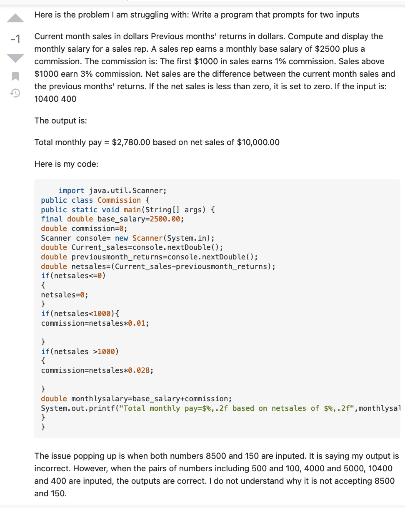
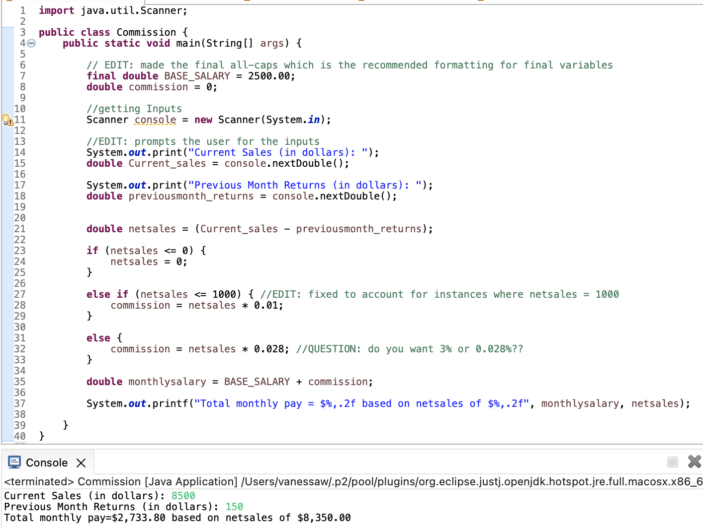

```{r setup, include=FALSE}
knitr::opts_chunk$set(echo = TRUE)
```
---
title: 'DS 202 - Homework #1'
author: 'Vanessa Whitehead'
date: '09/19/2022'
---

## Asking good questions


Asking good questions is a valuable skill to have - asking questions in an online setting is both easier and harder than asking questions in person: we can prepare to ask a question but we are also expected to prepare.
The links posted here give some advice on how to ask good questions:

- stackoverflow's [Asking a good question](http://stackoverflow.com/help/how-to-ask)

- R's [Posting guidelines](https://www.r-project.org/posting-guide.html)

- [minimal complete verifiable example](https://stackoverflow.com/help/mcve), [minimal reproducible example](https://www.tidyverse.org/help/)


Follow these links and read through the advice given, then

<br>
**0. Download the (R)Markdown file with these homework instructions to use as a template for your work. Make sure to replace "Your Name" in the YAML with your name.**

<br>
**1. Pick one question from stackoverflow and identify a minimum of three way(s) in which it is not asked well.**

|           **Question: **"Commission Salary Input"
|           **Issues: **
|           **a.** The question is not put in a question format. 
|           **b.** The question offers no specifics on the issue.
|           **c.** The formatting of the code makes makes it hard to read 
<br>

**2. (1 point) Which question did you pick (link to it).**  

|          https://stackoverflow.com/questions/73780576/commission-salary-input

<br>
**3. (1 point) Take a screenshot (or take a picture with your phone). Make sure to place the image in the same folder as your Rmarkdown file  and include it in your (R)markdown file.**

|          {width=60%}

<br>
**4. (3 points) Relate the readings to how the question is phrased: for that, write a paragraph on what a good question should do and then state what the stackoverflow question does. Identify at least three shortcomings.**

|          **A Good Question:**
|          A good stackoverflow question should summarize the problem at hand using correct grammar. The problem should be introduced before the code is. The code included should  be minimal. Just enough code should be included so that the error is reproducible. The error should also be specified. The question should also include relevant tags. 

<br>

|          **What the Stackoverflow Question Does:**
|          The stackoverflow question gives no insight into the problem they are running into. 
|          The example question does introduce the issue before the code.
|          The way the code and the question are written add confusion. Partly because the code was poorly formmatted. 
|          A question that arises is "Is the commision for sales >$1000 supposed to be 3% or 2.8%?"
|          The error was not reproducible. When I ran the code, I did not run into the error. 

<br>
**5. (3 points) Re-phrase the question to make it better. You can use placeholders for information that is not given in the original question, e.g. "version" or "platform".**

|          A better way to ask the question is to include the name of the error they were running into in the questions. 
|          They did not specify what error they were running into anywhere in their post, so I will supplement it with a random error. 
<br>

|          **For example:** "Why does the input '8500   150' yeild a *Complie Error* when other inputs don't"
|          I would describe the intention of the code similarly, but edit it a little more for some clarification and grammar
|          I would also include a screenshot or a description of the actual error.
|          Here is a screenshot of how I formatted the code to make it more legible. It also that shows that I did not run into any errors: 

<br>

|          **Code:**
|             {width=60%}
 
<br>

**Note:** (2 points) make sure that your submission is fully reproducible, i.e. the TA and I will 'knit' your submission in RStudio. Including any links to files is the tricky part here. Make sure that you don't use any file structure that depends on your computing environment.

<br>

For the submission: submit a zipped file  solution in an R Markdown file and (just for insurance) submit the corresponding html (or Word) file with it. 


